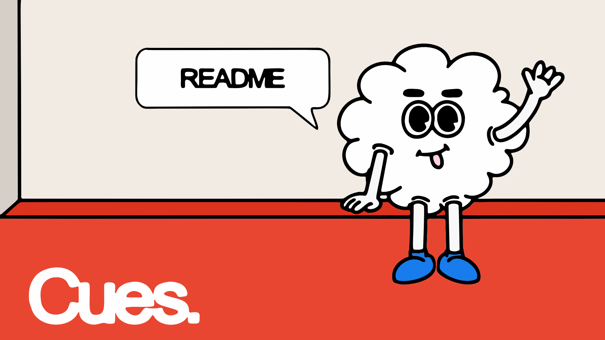
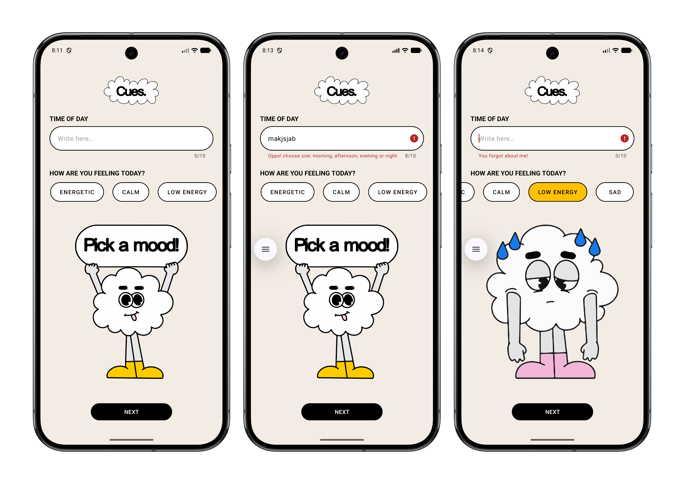
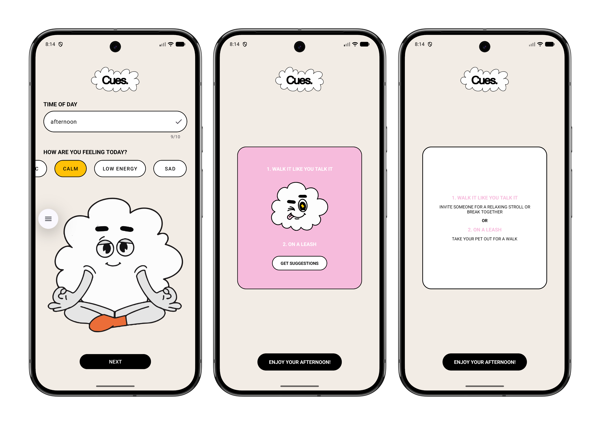

# CUES.

 

## Youtube Link
### Demo Video
Watch the app in action: https://youtu.be/8OqIWdSVxyM

## Meaning Behind “CUES”
Cues. represents subtle guidance- the small signals that help us make decisions in everyday life. Just like changes in light or mood throughout the day, cues influence our behaviour naturally. This app embraces that idea by offering gentle suggestions, helping users make decisions without overthinking or feeling overwhelmed.

## Overview
Cues. is a simple and intuitive Android application that helps users decide what to do based on their current mood and time of day. Instead of overanalysing or endlessly scrolling, the app provides quick, meaningful suggestions that encourage users to stay present and make enjoyable choices.

## Features
- Suggests activities based on:
   - Time of day (morning, afternoon, evening, night)
   - User mood (calm, energetic, sad, low energy)
- Minimal and user-friendly interface
- Instant results with no complex setup
- Interactive suggestion display using a flip card
- Clean and responsive UI design

## Design Considerations
The app focuses on simplicity, clarity, and user comfort:
- Soft visuals (e.g. cloud mascot) create a calm experience  
- Clear labels and readable layout improve accessibility  
- Minimal input reduces decision fatigue  
- Responsive feedback guides the user smoothly  
- Horizontal mood selection enhances usability  
- Flip card interaction adds engagement without complexity
The overall goal is to provide gentle guidance in an intuitive way.

## How to Use the App
Step 1: Enter the time of day (morning, afternoon, evening, or night)  
Step 2: Select your mood (calm, energetic, sad, or low energy)  
Step 3: Click "Next"  
Step 4: View your personalized activity suggestion  
Step 5: Click "Enjoy your [time of day]!" to return  

## Installation
Step 1: Clone the repository:
   - git clone https://github.com/Lethabomohlala/cues_app.git
- Step 2: Open the project in Android Studio
- Step 3:  Allow Gradle to sync
- Step 4: Run the app on:
   - an emulator  
   - or a physical Android device

## Tech Stack
- Language: Kotlin  
- Platform: Android Studio  
- UI: XML / ConstraintLayout  
- Build System: Gradle

## Version Control (GitHub)
Version control was managed using GitHub. A repository was created to store and manage the project. Code was regularly committed to track progress. Clear commit messages were used to describe changes. This allowed easy tracking, collaboration, and rollback if needed.

## GitHub Actions
GitHub Actions was used to automate the build process.
- A workflow file was created in:
   - View Build Workflow https://github.com/Lethabomohlala/cues_app/actions/workflows/build.yml
- The workflow runs automatically when code is pushed  
- It performs the following steps:
- Sets up the Java environment  
- Builds the android project using Gradle  
- Confirms the app compiles successfully  

## Testing
### Manual Testing
- All features were tested manually within the app. Different input combinations were checked. Invalid inputs were handled appropriately. Android Logcat was used to debug errors

### Automated Testing
- GitHub Actions was used to automatically build the app on each push. This verifies that the project compiles successfully at all times  

## Screenshots

### User Input and Validation
This screen shows the user entering the time of day and selecting a mood, including validation feedback for incorrect or missing inputs.

### Generated Suggestions
This screen displays personalized activity suggestions generated based on the user’s selected time of day and mood.

## Conclusion
Cues. demonstrates how simple design and thoughtful logic can improve everyday decision-making. By combining mood and time-based inputs, the app delivers quick, meaningful suggestions in a calm and engaging way.

## Author
- Lethabo Mohlala

## Description
This project was developed as part of an academic assignment.

## Tools Used
- Android Studio
- Google Gemini
   - Gemini was used as a development aid to assist with debugging, improving code structure, and enhancing UI animation components. This includes the implementation of the flip card animation and the splash screen GIF using Glide.

## Acknowledgements
Some parts of the code were assisted by Google Gemini AI.

## References
Google. 2026. _Gemini (AI assistant)_. [Software] Available at: https://ai.google.dev/ [Accessed 31 Mar. 2026].

OpenAI. 2026. _ChatGPT (GPT-5.3)_. [Large language model]. Available at: https://chat.openai.com [Accessed 31 Mar. 2026].

